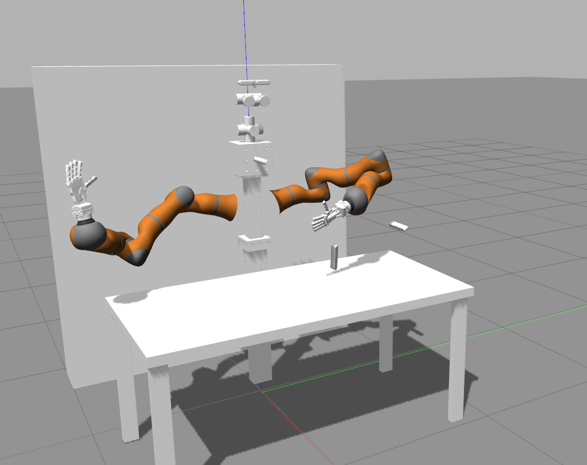

# Boris, the IRLab Dual Manipulator Robot, University of Birmingham

The IRLab Boris robot is composed of two Kuka LWR equipped with two Pisa/IIT Soft Hands each. The arms are mounted on a torso that is fixed on a working table.

This package uses [ROS/kinetic](http://wiki.ros.org/kinetic/Installation/Ubuntu) with Gazebo7 on [Ubuntu 16.04](http://www.ubuntu.com/download/desktop).

## Install dependencies

* `sudo apt-get install python-rosinstall python-rosinstall-generator python-wstool build-essential`

* `sudo apt-get install ros-kinetic-ros-controllers ros-kinetic-ros-control ros-kinetic-gazebo-ros-control ros-kinetic-moveit`

## Installation on ROS Kinetic and Ubuntu 16.04

Create a catkin workspace:

* `mkdir -p $HOME/Projects/boris_ws/src`

Clone boris-robot repo inside `src` directory of your catkin workspace:

* `cd $HOME/Projects/boris_ws/src`

* `git clone https://github.com/eaa3/boris-robot.git`

Fetch required packages with wstool:

* `wstool init`

* `wstool merge boris-robot/boris-robot.rosinstall`

* `wstool update`

Install remaining dependencies using rosdep

* `rosdep install --from-paths . --ignore-src --rosdistro $ROS_DISTRO`

Build it

* `cd $HOME/Projects/boris_ws`
* `catkin_make`

## Use

The command to launch the robot in simulation is:

`roslaunch boris_description display.launch`

The command to launch the robot for real is:

`roslaunch boris_description display.launch use_rviz:=true load_moveit:=false use_calibration_package:=false left_arm_enabled:=true right_arm_enabled:=true use_robot_sim:=false`

Please, check the available options and docs for arguments with: 

`roslaunch --args boris_descrtiption display.launch`

By default, the simulation is paused at the begining to wait for all controllers and stuff load, otherwise, the robots move around without control. When the command above stop sending messages on the screen, you need to call the following service in a different terminal:

`rosservice call /gazebo/unpause_physics`

The configured groups in MoveIt! for this robot are:
* `right_arm`: a serial kinematic chain from `world` to `right_arm_7_link`
* `right_hand_arm`: a serial kinematic chain from `world` to `right_hand_palm_link` 
* `left_arm`: a serial kinematic chain from `world` to `left_arm_7_link`
* `left_hand_arm`: a serial kinematic chain from `world` to `left_hand_palm_link` 
* `head`: a kinematic tree containing all joints that belongs to the head
* `dual_hand_arm`: it contains groups `right_hand_arm` and `left_hand_arm` for bi-manual tasks.
* `full_robot`: it contains the grous `right_hand_arm`, `left_hand_arm` and `head`

There is a home pose called <GROUP_NAME>_home for each group that you can use readly.

Note: the `right_hand_arm` and `left_hand_arm` groups, hence the `full_robot` as well, do not include the hand synergy joints. This is only because in our demos, we don't _plan_ the hand closure, but just close it.

For the real scenario, check instruction on each of the components on how to set the real hardware up properly.

IMPORTANT: We don't use the mounting plate on the KUKA arms, the small disc that can be attached to the 7th link before the true end-effector. This is important for calibration and mounting the hand to be consistent with the model.

## Hand-eye calibration

TODO

## Useful configured commands

* UPLOAD ALL DRIVERS WITH ROBOT-CAMERA CALIBRATION BROADCASTER:

`roslaunch boris_description display.launch left_arm_enabled:=true right_arm_enabled:=true left_hand_enabled:=true right_hand_enabled:=true load_moveit:=false use_rviz:=false use_robot_sim:=false`

* UPLOAD ALL DRIVERS ONLY (NO CAMERA CALIBRATION): 

`roslaunch boris_description display.launch left_arm_enabled:=true right_arm_enabled:=true left_hand_enabled:=true right_hand_enabled:=true load_moveit:=false use_rviz:=false use_robot_sim:=false use_calibration_package:=false`

* UPLOAD MOVEIT ENVIRONMENT:

`roslaunch boris_description display.launch load_moveit:=true use_rviz:=false use_robot_sim:=false`

* UPLOAD EVERYTHING IN SIMULATION:

`roslaunch boris_description display.launch`

* UPLOAD SIMULATION DRIVERS ONLY (AS IF YOU LAUNCH THE ROBOT DRIVERS IN A REMOTE PC):

`roslaunch boris_description display.launch load_moveit:=true use_rviz:=false calibration:=false`

A suggested hardware cockpit setup, using the joint trajectory controller rqt plugin:

